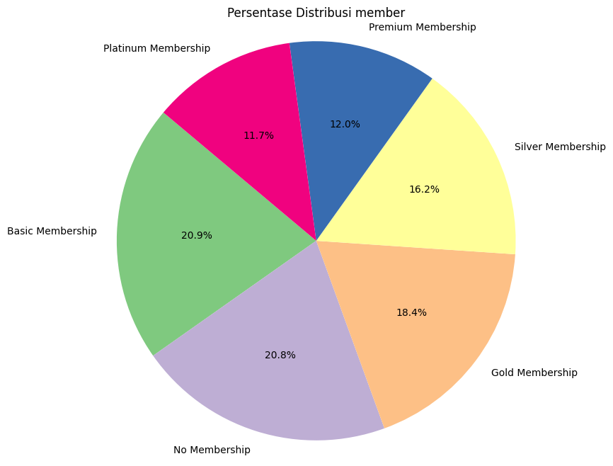
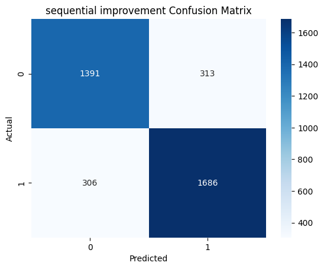

# Customer Churn Prediction Project README

## Objective

The objective of this project is to create predictions regarding customer churn and retention and provide valuable insights to the company based on the dataset. Specifically, our goals are:

1. Develop predictive models to identify customers likely to churn and those likely to stay.
2. Provide insights and recommendations to the company based on the dataset analysis.

## EDA

Based on the pie plot above, it can be observed that our target data is balanced, with only a slight difference. In terms of business, this implies that there are still many internet customers who churn or unsubscribe, and it is essential to identify the reasons behind this churn because this has a significant impact on our business profitability.

Based on the pie plot above, it can be seen that customers using the basic membership are still very high, and non-membership users rank second in terms of distribution. This can serve as an evaluation for the marketing department to attract customers to subscribe to memberships.

Based on the pie plot above, the three internet options we offer do not show significant differences in numbers, indicating that there are no major issues with the usage of any particular internet type.

## Models and Performance

In this project, we have utilized TensorFlow to build predictive models using both the Sequential and Functional APIs. 
After model creation and evaluation, we found that the Sequential model outperformed the Functional model in terms of predictive accuracy and performance.

Based on the output above, it can be observed that the sequential model has an accuracy of 0.92. Furthermore, this model achieved 1517 true positives and 1873 true negatives. Consequently, it had 180 false negatives and 126 false positives.

Based on the above output, it can be seen that the improved functional model has an accuracy of 0.85. Additionally, this model obtained 1516 true positives and 1620 true negatives. Therefore, it had 181 false negatives and 379 false positives.

## Insights and Recommendations

The analysis of the dataset has revealed several key insights, one of which is the high number of customers using the basic membership package. Additionally, non-membership usage ranks second in terms of customer distribution. This finding suggests an opportunity for the marketing department to focus on strategies to encourage more customers to subscribe to memberships or to enhance their existing membership plans. These insights can aid the company in customer retention efforts and improving customer satisfaction.

